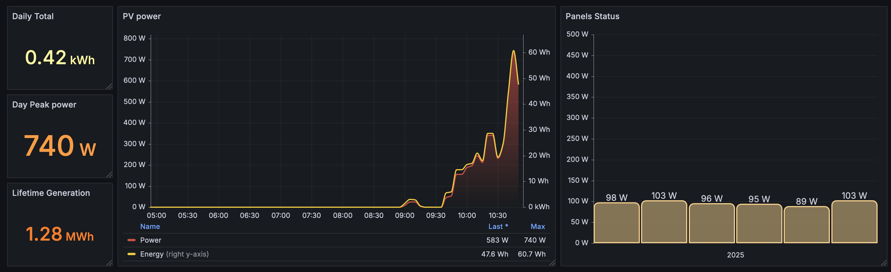

# apsystems2prom



I made this because I couldn't figure out how to scrap my local AP Systems ECU.
It queries the apsystemsema.com website and exposes prometheus metrics.
For this you need to check `Allow visitors to access to this system` in the settings and copy the `Authorized ID` as `USERNAME`.

Thanks to @skelgaard and his repository https://github.com/skelgaard/homeassistant-apsystems which saved me quite a bit of time !

### ENV variables
| Variable       | Purpose                                                                                                                                                                   |
|----------------|---------------------------------------------------------------------------------------------------------------------------------------------------------------------------|
| `USERNAME`     | your Authorized ID                                                                                                                                                        |
| `SYSTEM_ID`    | can be found on the source code of the main page when you're logged, search `managementClickCustomer` and inside is your system id                                        |
| `ECU_ID`       | your ECU Id, you can find it on your app or the website                                                                                                                   |
| `VID`          | `optional, allows per-panel power reporting. Can be found on the module page as request param on https://www.apsystemsema.com/ema/ajax/getViewAjax/getViewPowerByViewAjax |
| `PORT`         | the port to expose prometheus metrics                                                                                                                                     |
| `TICK`         | refresh period, anything under 5 minutes is wasteful, use go notation ('15m' or '1h')                                                                                     |
| `SLEEP_NIGHT`  | if set to `true`, will not query apsystems between the hours of sunset and sunup                                                                                          |
| `SUNUP_HOUR`   | if `SLEEP_NIGHT` enabled, will not query ap systems before this hour                                                                                                      |
| `SUNDOWN_HOUR` | if `SLEEP_NIGHT` enabled, will not query ap systems after this hour                                                                                                       |


### Exposes

| Metrics       | Info                                                   |
|---------------|--------------------------------------------------------|
| `ap_power`    | Power generation in Watt (latest value)                |
| `ap_energy`   | Energy generation in kWh (latest value)                |
| `ap_total`    | Total energy for the day, in kWh                       |
| `ap_max`      | Peak power of the day, in W                            |
| `ap_lifetime` | Lifetime generation, in kWh                            |
| `ap_panels`   | Power generation per panel in W (label key `panel_id`) |


The program compares the latest timestamp and only update values if apsystems returned a new timestamp.


### Usage
You can either run as-is or use the docker image, here is an example docker-compose:

```yaml
  apsystems2prom:
    container_name: apsystems2prom
    image: ghcr.io/koumbaya/apsystems2prom:latest
    restart: unless-stopped
    ports:
      - 8085:8085
    environment:
      - TZ=Europe/Paris
      - PORT=8085
      - TICK=5m
      - SLEEP_NIGHT=true
      - SUNUP_HOUR=7
      - SUNDOWN_HOUR=20
      - USERNAME=YOUR_USERNAME
      - SYSTEM_ID=YOUR_SYSTEM_ID
      - ECU_ID=YOUR_ECU_ID
```

and then add the job to your prometheus.yaml

```yaml
  - job_name: "apsystems2prom"
    static_configs:
      - targets: ["apsystems2prom:8085"]
```
